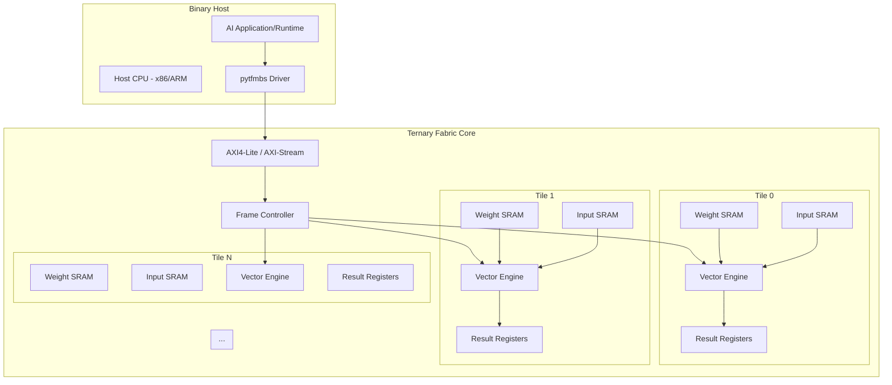
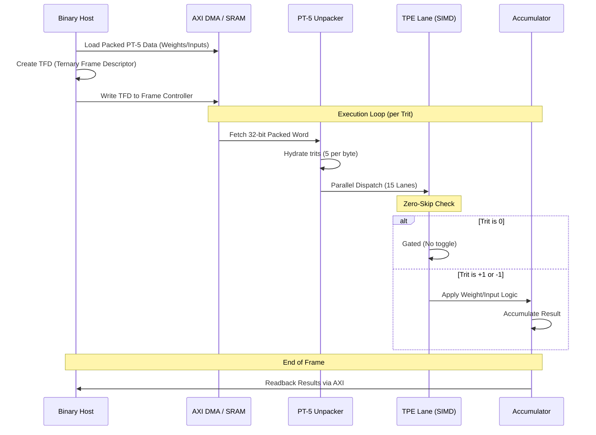

# Ternary Fabric Visualizations

This document provides visual representations of the Ternary Fabric architecture and its operational workflows.

## 1. Full-Stack Architecture

The following diagram illustrates the relationship between the Host CPU, the Frame Controller, and the multi-tile Ternary Fabric.

## 2. Hydration & SIMD Execution Workflow

The process of moving from packed PT-5 data to SIMD results is shown below.

## 3. PT-5 Memory Efficiency

PT-5 packing achieves higher density than standard 2-bit-per-trit encoding.

| Format | Trits per Byte | Efficiency |
| :--- | :--- | :--- |
| **Binary (2b/trit)** | 4 | 80.0% (4/5) |
| **PT-5** | 5 | **95.1%** |

*Efficiency calculation based on $\log_2(3^5) / 8$.*
